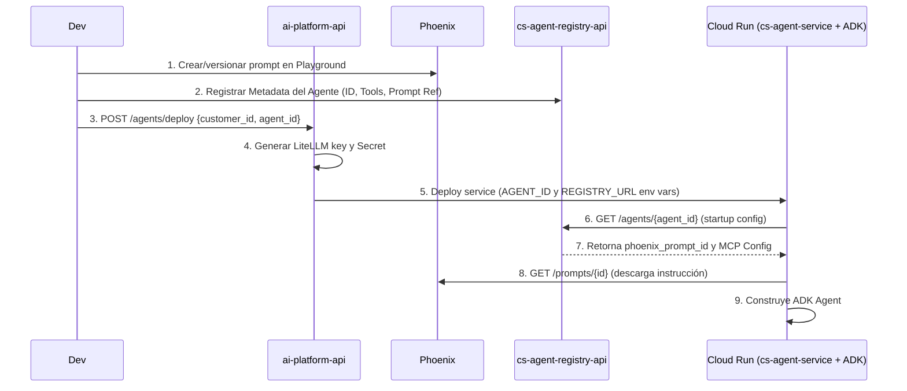

# ADR-001: Arquitectura del Sistema de Agentes Dinámicos

**Status:** Proposed  
**Date:** 2026-02-19  
**Autores:** Aldemar  

---

## Contexto

El sistema necesita soportar el deploy dinámico de agentes de IA por cliente, donde cada agente corre como un contenedor independiente en Cloud Run. Un mismo Docker image (`cs-agent-service`) se configura en runtime via Registry API, permitiendo múltiples agentes con comportamientos distintos sin generar nuevas imágenes.

**Framework principal adoptado:** [Google ADK (Agent Development Kit)](https://google.github.io/adk-docs/) — framework open-source de Google para construir, orquestar y desplegar sistemas multi-agente. Anunciado en Google Cloud NEXT 2025 y donado a Linux Foundation.

---

## Servicios Involucrados

| Servicio | Repo / Ubicación | Responsabilidad |
|----------|-----------------|-----------------|
| `cs-agent-service` | `conneskills/cs-agent-service` | Runtime A2A del agente — imagen Docker única con Google ADK |
| `cs-agent-registry-api` | `conneskills/cs-agent-registry-api` | Orquestador lógico: Mapping agents-skills-tools + Proxy de prompts |
| `ai-platform-api` | `conneskills/ai-platform-api` | **Plano de Infraestructura**: GCP (Cloud Run, Secrets), LiteLLM keys + User Secrets |
| `ui-usuario` | Pendiente | UI de gestión de credenciales de servicios externos y prompts |
| `litellm` | Servicio externo desplegado | Proxy LLM: rate limiting, routing, API keys por agente |
| `zenml` | Servicio externo desplegado | Pipelines de datos, procesamiento pesado, gestión de assets |
| `phoenix` (Arize) | Servicio externo | **Prompt Management Engine**, Observabilidad OTEL y Evals |
| `jobs` (Redis) | Infraestructura interna | Gestión de estado asíncrono de deploys y provisiones |

---

## Decisión 1: Google ADK como Framework de Agentes

### ¿Qué es Google ADK?

ADK es un framework Python open-source que proporciona:
- **Tipos de agentes** listos para usar (LlmAgent, SequentialAgent, ParallelAgent, LoopAgent)
- **Sistema de tools** estandarizado (FunctionTool, MCPToolset, AgentTool)
- **Protocolo A2A nativo** para comunicación inter-agente
- **Runner** para ejecución local y en producción
- **Integración directa con LiteLLM** como proveedor LLM

### Reemplazo de la implementación actual

| Actual (`cs-agent-service`) | Con Google ADK |
|---------------------------|--------------|
| `BaseAgent` custom | `LlmAgent` de ADK |
| `AgentService` custom con execution_type | `SequentialAgent`, `ParallelAgent`, etc. |
| `ReusableAgentExecutor(AgentExecutor)` | `Runner` de ADK |
| Lógica de A2A manual | A2A nativo del ADK |

---

## Decisión 2: Tipos de Agentes en Google ADK

### 2.1 LlmAgent (ex `Agent`)
Agente basado en LLM con razonamiento dinámico. El comportamiento es no-determinístico — el LLM decide qué tools usar y cómo responder.

```python
from google.adk.agents import LlmAgent
from google.adk.tools import FunctionTool

researcher = LlmAgent(
    name="agent-researcher",
    model="litellm/eo-agent-researcher",   # vía LiteLLM proxy
    instruction=system_prompt,              # resuelto desde Phoenix (via Registry)
    tools=[search_tool, summarize_tool],
)
```

**Usar cuando:** tareas de lenguaje natural, razonamiento flexible, decisiones dinámicas.

---

### 2.2 SequentialAgent
Ejecuta sub-agentes en **orden fijo y determinístico**. El output de cada agente se pasa como contexto al siguiente. No usa LLM para controlar el flujo.

```python
from google.adk.agents import SequentialAgent

pipeline = SequentialAgent(
    name="research-pipeline",
    sub_agents=[researcher, analyst, writer],
)
```

**Usar cuando:** pipelines paso-a-paso donde cada etapa depende de la anterior (ej: investigar → analizar → redactar).

---

### 2.3 ParallelAgent
Ejecuta sub-agentes **concurrentemente**. Recolecta todos los resultados al terminar. Determinístico, sin LLM para control de flujo.

```python
from google.adk.agents import ParallelAgent

fan_out = ParallelAgent(
    name="multi-domain-research",
    sub_agents=[legal_agent, financial_agent, market_agent],
)
```

**Usar cuando:** tareas independientes que se benefician de ejecución simultánea (ej: análisis multi-dominio).

---

### 2.4 LoopAgent
Ejecuta sub-agentes **en bucle** hasta que una condición sea verdadera. Útil para procesos iterativos con criterio de parada.

```python
from google.adk.agents import LoopAgent

refiner = LoopAgent(
    name="doc-refiner",
    sub_agents=[draft_agent, critic_agent],
    max_iterations=5,
)
```

**Usar cuando:** refinamiento iterativo, reintentos con mejora progresiva.

---

### 2.5 Custom Agent (BaseAgent)
Extiende `BaseAgent` para lógica personalizada que no encaja en los patrones anteriores.

```python
from google.adk.agents import BaseAgent

class HybridAgent(BaseAgent):
    async def _run_async_impl(self, ctx):
        # lógica personalizada
        ...
```

---

### 2.6 Agent-as-Tool
Un agente especializado puede ser usado como **tool** por otro agente. Permite modularidad extrema.

```python
from google.adk.tools import agent_tool

legal_tool = agent_tool.AgentTool(agent=legal_agent)

coordinator = LlmAgent(
    name="coordinator",
    tools=[legal_tool, financial_tool],  # sub-agentes como tools
)
```

---

## Decisión 3: Sistema de Tools (LiteLLM como MCP Gateway)

### 3.1 Cambio de Paradigma: LiteLLM como Registro de Tools
En lugar de que cada agente sea un cliente MCP individual conectándose a múltiples servidores, delegamos la gestión de tools a **LiteLLM**. 

**LiteLLM actúa como un MCP Gateway:**
1.  **Registro Centralizado:** Los servidores MCP (`mcp-jira`, `mcp-database`, etc.) se registran en LiteLLM.
2.  **Conversión de Protocolo:** LiteLLM convierte automáticamente las herramientas MCP en definiciones de **OpenAI Function Calling**.
3.  **Gobernanza:** Permite aplicar Rate Limiting, Logging y RBAC a nivel de tool call.

### 3.2 Estrategia de Carga y Resolución de Parámetros MCP

El agente obtiene su `runtime_config` desde el Registry. Esta configuración define los servidores MCP requeridos y sus parámetros de conexión.

**Manejo de Parámetros (Text vs Secret):**
Cada parámetro de un MCP puede ser de dos tipos:
*   **`type: text`**: El valor se encuentra en texto plano en la configuración del Registry y se usa directamente.
*   **`type: secret`**: El valor es una referencia a un secreto en la plataforma.

**Flujo de Resolución en Runtime (Agent Startup):**
1.  El Agente carga el `runtime_config` del **Registry**.
2.  Itera sobre los parámetros de cada MCP:
    *   Si es `text`, toma el valor.
    *   Si es `secret`, el Agente hace una petición a la `ai-platform-api`:
        `GET /api/v1/secrets/{secret_name}/value`
3.  Una vez resueltos todos los parámetros, el Agente utiliza estos valores para configurar el acceso a las tools vía **LiteLLM** (inyectando la configuración dinámica necesaria en los headers de las peticiones de completación).

### 3.3 Autenticación Passthrough (X-User-Id)

Para cumplir con la **Decisión 9**, la autenticación se maneja mediante el envío de contexto:

1.  **Agente:** Inyecta un header `X-User-Id` en cada llamada a LiteLLM.
2.  **LiteLLM:** Está configurado para hacer **passthrough** de este header hacia el servidor MCP destino.
3.  **Servidor MCP:** Recibe el `X-User-Id`, consulta a **Secret Manager** y ejecuta la acción con las credenciales reales del usuario.

### 3.4 BuiltIn Tools (Estáticas)
Las tools implementadas directamente en el código de la imagen (`src/tools/function_tools.py`) se mantienen para lógica local que no requiere red.

---

## Decisión 4: Arquitecturas Multi-Agente

### Patrón A: Coordinator/Dispatcher (Recomendado para casos complejos)

Un agente coordinador recibe la tarea y decide a qué agentes especializados delegar, usando **Agent-as-Tool**.

```
User Request
    │
    ▼
CoordinatorAgent (LlmAgent)
    ├── legal_tool    → LegalAnalystAgent
    ├── research_tool → ResearcherAgent
    └── finance_tool  → FinancialAgent
```

```python
coordinator = LlmAgent(
    name="coordinator",
    model="litellm/gpt-4o",
    instruction="Decide which specialist agent to call based on the task.",
    tools=[
        agent_tool.AgentTool(agent=legal_agent),
        agent_tool.AgentTool(agent=researcher_agent),
        agent_tool.AgentTool(agent=financial_agent),
    ],
)
```

---

### Patrón B: Sequential Pipeline

```
Input → ResearcherAgent → AnalystAgent → WriterAgent → Output
```

Mapea a `execution_type: "sequential"` en el Registry actual.

---

### Patrón C: Parallel Fan-Out / Gather

```
          ┌─── LegalAgent ───┐
Input ────┼─── MarketAgent ──┼──── AggregatorAgent ──── Output
          └─── TechAgent ────┘
```

Mapea a `execution_type: "parallel"` + `aggregator_role` en el Registry actual.

---

### Patrón D: Hierarchical (Jerarquía de Coordinadores)

Para problemas muy complejos con sub-dominios:

```
RootCoordinator
    ├── LegalCoordinator
    │       ├── ContractAnalyst
    │       └── ComplianceAgent
    └── ResearchCoordinator
            ├── WebResearcher
            └── DataAnalyst
```

---

### Patrón E: Hub-Spoke

Un agente hub central enruta solicitudes a agentes spoke especializados basándose en el tipo de tarea. Similar a coordinator pero con routing explícito.

```
User Request
    │
    ▼
HubAgent (LlmAgent con routing)
    │
    ├── route_to: legal_spoke    → LegalAgent
    ├── route_to: finance_spoke  → FinanceAgent
    └── route_to: tech_spoke     → TechAgent
```

---

### Mapeo: Registry `execution_type` → ADK Agent Class

| Registry `execution_type` | ADK Class | Notas |
|--------------------------|-----------|-------|
| `single` | `LlmAgent` | Un rol |
| `sequential` | `SequentialAgent` | Pipeline ordenado |
| `parallel` | `ParallelAgent` + `LlmAgent` agregador | Fan-out/gather |
| `coordinator` | `LlmAgent` con `AgentTool`s | Dispatcher dinámico |
| `hub-spoke` | `LlmAgent` con `AgentTool`s + routing | Hub decide spoke |

---

## Decisión 5: Comunicación A2A entre Contenedores

ADK tiene soporte nativo para el protocolo A2A (Agent-to-Agent), donado a Linux Foundation en abril 2025. Funciona como "HTTP para agentes": descubrimiento via Agent Cards, comunicación async estandarizada.

```
CloudRun: eo-agent-researcher (A2A Server)
    ▲
    │  POST / {jsonrpc: "2.0", method: "message/send"}
    │
CloudRun: eo-agent-legal-analyst (A2A Client)
```

Cada contenedor expone su Agent Card en `GET /.well-known/agent.json`.

---

## Decisión 6: LiteLLM como Proxy Exclusivo de LLM y Tools

**Decisión:** LiteLLM es el **único punto de salida** hacia proveedores LLM y servidores MCP. ADK usa LiteLLM como backend vía su interfaz OpenAI-compatible.

```python
# Configuración ADK → LiteLLM
researcher = LlmAgent(
    model="litellm/eo-agent-researcher",  # prefijo "litellm/" activa el proxy
    # ADK usa LITELLM_URL + LITELLM_API_KEY del entorno
)
```

**Responsabilidades de LiteLLM:**
- Rate limiting y budgets por organización/cliente
- Routing: `eo-agent-researcher` → `claude-3-5-sonnet` (configurable sin redeploy)
- API key por agente (aislamiento de costos)
- **Registro de MCP Servers y exposición de tools como funciones**
- Logging de requests, tokens y tool calls

---

## Decisión 7: Gestión de Prompts (Phoenix como Engine + Registry como Orchestrator)

### Separación de responsabilidades

| Responsabilidad | Servicio | Justificación |
|-----------------|----------|---------------|
| **Almacenamiento y Versionado** | Phoenix (Arize) | Producto maduro con Playground y gestión de versiones nativa. |
| **Mapping Lógico** | `cs-agent-registry-api` | Asocia un `agent_id` con un `phoenix_prompt_id`. No guarda el texto. |
| **Validación de prompt** | **Agente (Runtime)** | Al arrancar, el agente valida su propia configuración contra el Registry y Phoenix. |
| **Observabilidad** | Phoenix (Arize) | Tracing OTEL y evaluación de calidad integrada con el prompt management. |

### Estrategia de Delegación

En lugar de reinventar la lógica de gestión de prompts, se delega en **Arize Phoenix**. La `ai-platform-api` asume que la metadata del agente (incluyendo su `phoenix_prompt_id`) ya fue registrada previamente en el Registry.

### Cadena de resolución de prompt (Runtime en `cs-agent-service`)

Al arrancar, el agente consulta al Registry para saber qué `prompt_id` le corresponde y luego lo descarga desde Phoenix:

```
1. prompt_inline en config      → usa directamente (para tests rápidos)
2. phoenix_prompt_id en config  → descarga desde API de Phoenix (Fuente de verdad)
3. prompt_ref en config         → fallback Registry (legacy)
4. Archivo local                → /app/prompts/{role}.txt (fallback final)
```

### Multi-tenancy en Phoenix via Platform API

Dado que Phoenix es single-tenant, la `ai-platform-api` implementará un **Proxy de Aislamiento**:
- Recibe peticiones de la UI con `customer_id`.
- Traduce el `customer_id` a un set de tags o prefijos en Phoenix.
- Asegura que un cliente solo pueda leer/editar sus propios prompts.

---

## Decisión 8: ZenML para Heavy Lifting

ZenML maneja todas las tareas de procesamiento intensivo, **fuera** del ciclo request/response del agente.

**Integración con `ai-platform-api`:**
Se registrará como **Servicio Externo** tipo `ZENML` (`POST /api/v1/external-services`). Aprovecha la infraestructura existente para gestionar credenciales y conectividad.

**Responsabilidades:**
- Ingesta y limpieza de datos
- Generación de embeddings para RAG
- Fine-tuning de modelos por cliente
- Gestión de artifacts (modelos, datasets) via ZenML Artifact Store
- Orquestación de workflows multi-step

**Cliente:** `zenml_client.py` interactúa con la API de ZenML para trigger pipelines y gestionar workspaces.

---

## Decisión 9: Autenticación MCP con Credenciales de Usuario

### Principio

La plataforma **NO** almacena ni gestiona credenciales de servicios externos del usuario (Jira, Slack, GitHub, etc.). El usuario es dueño de sus credenciales y las configura directamente a través de una UI dedicada.

### Arquitectura con LiteLLM Gateway

```
┌─────────────────────────────────────────────────────────────────────────┐
│                    FLUJO DE CREDENCIALES MCP                            │
├─────────────────────────────────────────────────────────────────────────┤
│                                                                         │
│  CONFIGURACIÓN (UI Usuario)                                            │
│  ┌─────────┐      ┌─────────────────┐      ┌──────────────────┐        │
│  │ Usuario │─────►│ UI Credenciales │─────►│ Secret Manager   │        │
│  └─────────┘      │ "Conectar Jira" │      │ user-creds/...   │        │
│                   └─────────────────┘      └──────────────────┘        │
│                                                                         │
│  RUNTIME                                                                │
│  ┌─────────┐      ┌─────────┐      ┌─────────┐      ┌────────────────┐   │
│  │ Agente  │─────►│LiteLLM  │─────►│MCP Srv  │─────►│  Secret Mgr    │   │
│  │         │      │ Gateway │      │         │      │ user-creds-... │   │
│  │X-User-Id│──────┼─────────┼──────┼─────────┼─────►└────────────────┘   │
│  └─────────┘      └─────────┘      └────┬────┘            │           │
│                                        │                  ▼           │
│                                        │           ┌─────────────┐    │
│                                        └──────────►│ Jira API    │    │
│                                                    └─────────────┘    │
└─────────────────────────────────────────────────────────────────────────┘
```

### Estructura en Secret Manager

Los secretos se almacenan con nombres únicos planos (siguiendo convenciones de GCP):

*   `user-creds-{user_id}-jira`
*   `user-creds-{user_id}-slack`
*   `user-creds-{user_id}-github`
*   `user-creds-{user_id}-google-workspace`

### Flujo Detallado

#### 1. Configuración (UI Usuario - Futuro)

```
Usuario → UI → Secret Manager: user-creds-{user_id}-{service}
```

#### 2. Resolución en Runtime
... (se mantiene igual) ...

#### 3. El Agente Pasa el Contexto
... (se mantiene igual) ...

### Responsabilidades

| Componente | Responsabilidad |
|------------|-----------------|
| **UI Usuario** | Capturar, actualizar y eliminar credenciales del usuario directamente en Secret Manager |
| **Secret Manager** | Almacenar credenciales cifradas con rotación automática |
| **MCP Server** | Resolver credenciales por `user_id` + `service_type` |
| **Agente** | Pasar `user_id` en contexto de cada tool call |
| **ai-platform-api** | Exponer endpoint `GET /api/v1/secrets/{name}/value` para resolución de secretos de sistema |

### Seguridad
... (se mantiene igual) ...

- **Cifrado**: Secret Manager cifra en reposo y en tránsito
- **Aislamiento**: Cada usuario solo accede a sus propios secretos
- **Auditoría**: Cloud Audit Logs registra accesos a secretos
- **Rotación**: El usuario puede rotar credenciales en cualquier momento desde la UI

---

## Flujo de Deploy End-to-End



---

## Estructura del cs-agent-service con ADK

```
cs-agent-service/
├── Dockerfile
├── src/
│   ├── __main__.py        # A2A server entry (uvicorn + ADK Runner)
│   ├── agent_factory.py   # Construye el ADK Agent según runtime_config
│   ├── tools/
│   │   ├── function_tools.py   # FunctionTools custom
│   │   └── mcp_toolsets.py     # MCPToolset configs por servidor
│   └── prompts/
│       └── resolver.py    # Cadena: Phoenix API → Registry Fallback → local file
└── prompts/               # Fallback files por rol
```

### `agent_factory.py` — Núcleo de la migración a ADK

```python
from google.adk.agents import LlmAgent, SequentialAgent, ParallelAgent, LoopAgent, BaseAgent
from google.adk.tools import agent_tool

class AgentFactory:
    def build(self, runtime_config: dict, resolved_prompts: dict) -> BaseAgent:
        execution_type = runtime_config.get("execution_type", "single")
        roles = runtime_config.get("roles", [])

        if execution_type == "single":
            return self._build_llm_agent(roles[0], resolved_prompts)

        elif execution_type == "sequential":
            sub = [self._build_llm_agent(r, resolved_prompts) for r in roles]
            return SequentialAgent(name="pipeline", sub_agents=sub)

        elif execution_type == "parallel":
            aggregator_name = runtime_config.get("aggregator_role")
            parallel = [self._build_llm_agent(r, resolved_prompts)
                        for r in roles if r["name"] != aggregator_name]
            agg = self._build_llm_agent(
                next(r for r in roles if r["name"] == aggregator_name), resolved_prompts
            ) if aggregator_name else None
            pa = ParallelAgent(name="fan-out", sub_agents=parallel)
            if agg:
                return SequentialAgent(name="parallel-gather",
                                       sub_agents=[pa, agg])
            return pa

        elif execution_type == "coordinator":
            workers = [self._build_llm_agent(r, resolved_prompts) for r in roles
                       if r["name"] != runtime_config.get("coordinator_role")]
            coord_cfg = next(r for r in roles
                             if r["name"] == runtime_config.get("coordinator_role"))
            coord = self._build_llm_agent(coord_cfg, resolved_prompts)
            coord.tools += [agent_tool.AgentTool(agent=w) for w in workers]
            return coord

        elif execution_type == "hub-spoke":
            spokes = [self._build_llm_agent(r, resolved_prompts) for r in roles
                      if r["name"] != runtime_config.get("hub_role")]
            hub_cfg = next(r for r in roles
                           if r["name"] == runtime_config.get("hub_role"))
            hub = self._build_llm_agent(hub_cfg, resolved_prompts)
            hub.tools += [agent_tool.AgentTool(agent=s) for s in spokes]
            return hub

        raise ValueError(f"Unknown execution_type: {execution_type}")

    def _build_llm_agent(self, role_cfg: dict, prompts: dict) -> LlmAgent:
        tools = self._load_tools(role_cfg)
        return LlmAgent(
            name=role_cfg["name"],
            model=f"litellm/{role_cfg.get('model', 'gpt-4o-mini')}",
            instruction=prompts[role_cfg["name"]],
            tools=tools,
        )

    def _load_tools(self, role_cfg: dict) -> list:
        tools = []
        for tool_cfg in role_cfg.get("tools", []):
            if tool_cfg.get("active", True) is False:
                continue
            if tool_cfg["provider"] == "mcp":
                from src.tools.mcp_toolsets import get_mcp_toolset
                tools += get_mcp_toolset(tool_cfg["mcp_server"]).get_tools()
            elif tool_cfg["provider"] == "builtin":
                from src.tools.function_tools import get_builtin_tool
                tools.append(get_builtin_tool(tool_cfg["id"]))
        return tools
```

---

## Integración con Infraestructura Existente (Brechas cubiertas)

### 1. Prerrequisito: Onboarding de Cliente
El despliegue de agentes depende del flujo existente `POST /api/v1/customers`. Este proceso aprovisiona:
- **Usuario LiteLLM:** Necesario para generar API Keys de agentes.
- **Workspace ZenML:** Necesario para que el agente dispare pipelines.
- **Proyecto Jira:** (Opcional) Para que el agente cree tickets.

### 2. Bases de Datos Dedicadas
Los servicios *stateful* requeridos por la arquitectura (Registry API, Phoenix) usarán el endpoint existente `POST /external-services/{id}/create_service_database` para provisionar sus DBs en Postgres con credenciales rotadas automáticamente en Secret Manager.

### 3. Build de Imagen Base (CI/CD)
La imagen única `cs-agent-service` se gestionará mediante el endpoint `POST /api/v1/services/setup-image-build`, conectando el repo a Cloud Build. Esto asegura que cualquier actualización al runtime de ADK se propague automáticamente a la imagen `latest`.

### 4. Logs vs Tracing
Se mantendrá una estrategia dual de observabilidad:
- **Infraestructura/Crash:** Vía `GET /api/v1/services/{name}/logs` (Cloud Logging).
- **Comportamiento LLM/A2A:** Vía Phoenix (OTEL Traces).

### 5. Asincronía
Todas las operaciones de deploy descritas en este ADR se ejecutarán como **Jobs asíncronos** (`/api/v1/jobs/{job_id}`), respetando el patrón de diseño actual de la plataforma.

---

## Modificaciones Requeridas al cs-agent-registry-api

### 1. Soporte para `phoenix_prompt_id`
El modelo de `Agent` y `Role` debe incluir un campo para referenciar el ID de prompt en Phoenix. El Registry deja de ser fuente de verdad para el *texto* del prompt.

### 2. Ampliar `tool_ids` para soporte MCP
El modelo `ToolDefinition` necesita soportar `provider: "mcp"` con `mcp_server_url` y campo `active`.

### 3. Auto-registration al startup
Al recibir `PATCH /agents/{id}/url`, el agente se auto-registra en LiteLLM `/v1/agents` si `is_public: true`.

---

## Modificaciones Requeridas al ai-platform-api

### 1. Resolución de Secretos para Agentes
Asegurar que el endpoint `GET /api/v1/secrets/{name}/value` esté disponible y sea accesible por los agentes durante su inicialización para resolver parámetros MCP de tipo `secret`.

### 2. Añadir `PHOENIX` y `ZENML` al `ExternalServiceType`
Permitir el registro de estos servicios para la gestión de sus bases de datos y secretos de infraestructura.

```python
class ExternalServiceType(str, Enum):
    # ... existentes ...
    PHOENIX = "phoenix"    # Prompt Management + Tracing
    ZENML = "zenml"        # Pipelines de datos
```

### 3. Flujo de Infraestructura en `agent_deployment.py`
Simplificar el despliegue para que solo se encargue de:
- Generar y almacenar la LiteLLM API Key del agente.
- Desplegar el contenedor con las variables de entorno `AGENT_ID` y `REGISTRY_API_URL`.
- **Eliminar cualquier validación de prompts o llamadas al Registry.**

---

## Consecuencias y Trade-offs

| Decisión | Beneficio | Riesgo |
|----------|-----------|--------|
| Google ADK | Tipos de agentes probados en producción por Google, soporte A2A nativo | Dependencia del framework, curva de aprendizaje |
| Phoenix para Prompts | **Uso de producto maduro (Playground, Evals)**, ahorro de desarrollo en Registry | Dependencia externa crítica para el arranque del agente |
| Registry como Orquestador | Desacoplamiento total; el Registry sabe "qué" herramientas tiene el agente sin importar dónde vive el prompt | Latencia adicional en el arranque al tener que saltar de Registry a Phoenix |
| Multi-tenancy Proxy | Control total sobre quién accede a qué en Phoenix | Capa adicional de mantenimiento en Platform API |
| LiteLLM proxy | Rate limiting y routing centralizado | Punto único de fallo para LLM calls |
| ZenML para pipelines | Separación clara de concerns | Setup inicial complejo |
| Credenciales en SM | Usuario controla sus secretos | Dependencia de Secret Manager |

---

## Plan de Implementación

### Fase 1 — Migración a Google ADK (cs-agent-service)
- [ ] Implementar `src/agent_factory.py` (ADK v2).
- [ ] Implementar `src/prompts/resolver.py` (Registry -> Phoenix API).

### Fase 2 — Infraestructura en ai-platform-api
- [ ] Modificar `agent_deployment.py` para despliegue simplificado (Infra-only).
- [ ] Asegurar acceso de agentes al Secrets API.

### Fase 3 — Registry Upgrades (cs-agent-registry-api)
- [ ] Añadir campo `phoenix_prompt_id` y mapping de herramientas MCP.
- [ ] Exponer configuración `runtime_config` para agentes.

### Fase 4 — Observabilidad y Pipelines
- [ ] Configurar Phoenix como `ExternalService`.
- [ ] Pipeline de setup de customer en ZenML.
- [ ] OTEL tracing end-to-end → Phoenix.

---

## Diagrama de Componentes

```mermaid
graph TB
    subgraph "Control Plane"
        PA[ai-platform-api<br/>Infra Orchestrator]
        REG[cs-agent-registry-api<br/>Logical Mapping]
    end

    subgraph "User Layer"
        UI[UI Usuario<br/>Gestión Prompts/Creds]
    end

    subgraph "External Services"
        LL[LiteLLM<br/>Rate Limit + Routing]
        ZN[ZenML<br/>Pipelines + Assets]
        PX[Phoenix/Arize<br/>Prompt Engine + Tracing]
        SM[Secret Manager<br/>Credentials]
    end

    subgraph "Runtime - Cloud Run"
        subgraph "cs-agent-service + ADK"
            AF[AgentFactory]
            A1[LlmAgent]
        end
    end

    UI -->|edita prompts| REG
    UI -->|gestiona creds| PA
    
    PA -->|deploy infra| AF
    PA -->|user credentials| SM
    
    AF -->|1. Get Config| REG
    REG -->> AF: phoenix_prompt_id
    AF -->|2. Get Prompt| PX
    AF -->|3. Get Secrets| PA
    
    A1 -->|completions| LL
    A1 -->|traces| PX
```

---

## Referencias

- [Arize Phoenix Prompt Management Docs](https://docs.arize.com/phoenix/prompt-management)
- [Google ADK Docs](https://google.github.io/adk-docs/)
- [MCPToolset Docs](https://google.github.io/adk-docs/tools/mcp-tools/)
- [cs-agent-service README](../README.md)
- [ai-platform-api agent_deployment.py](../ai-platform-api/app/services/agent_deployment.py)
