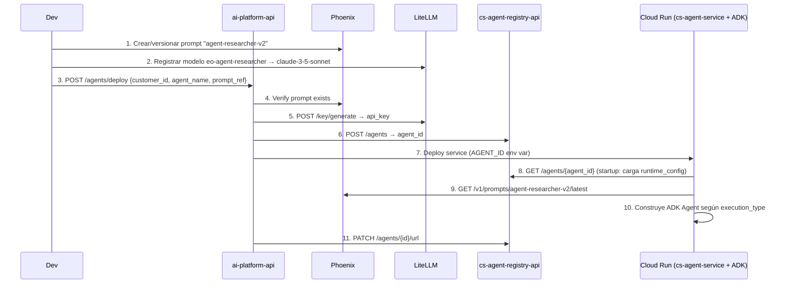
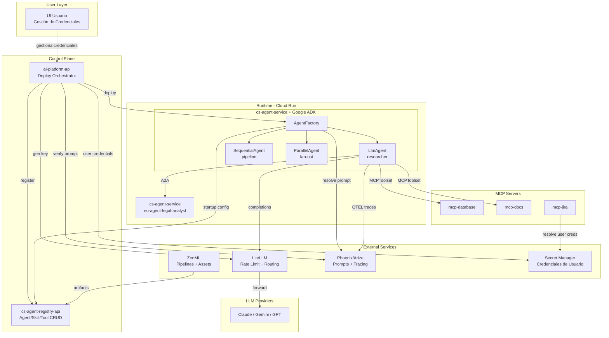

# ADR-001: Arquitectura del Sistema de Agentes Dinámicos

**Status:** Proposed  
**Date:** 2026-02-19  
**Autores:** Aldemar  

---

## Contexto

El sistema necesita soportar el deploy dinámico de agentes de IA por cliente, donde cada agente corre como un contenedor independiente en Cloud Run. Un mismo Docker image (`cs-agent-service`) se configura en runtime via Registry API, permitiendo múltiples agentes con comportamientos distintos sin generar nuevas imágenes.

**Framework principal adoptado:** [Google ADK (Agent Development Kit)](https://google.github.io/adk-docs/) — framework open-source de Google para construir, orquestar y desplegar sistemas multi-agente. Anunciado en Google Cloud NEXT 2025 y donado a Linux Foundation.

---

## Servicios Involucrados

| Servicio | Repo / Ubicación | Responsabilidad |
|----------|-----------------|-----------------|
| `cs-agent-service` | `conneskills/cs-agent-service` | Runtime A2A del agente — imagen Docker única con Google ADK |
| `cs-agent-registry-api` | `conneskills/cs-agent-registry-api` | CRUD de agents, skills, tools, RAG + PostgreSQL |
| `ai-platform-api` | `conneskills/ai-platform-api` | Orchestrator de deploy: GCP Cloud Run, Secrets, LiteLLM keys |
| `ui-usuario` | Pendiente | UI de gestión de credenciales de servicios externos (Jira, Slack, etc.) |
| `litellm` | Servicio externo desplegado | Proxy LLM: rate limiting, routing, API keys por agente |
| `zenml` | Servicio externo desplegado | Pipelines de datos, procesamiento pesado, gestión de assets |
| `phoenix` (Arize) | Servicio externo | Observabilidad OTEL, tracing, **gestión persistente de prompts** |
| `jobs` (Redis) | Infraestructura interna | Gestión de estado asíncrono de deploys y provisiones |

---

## Decisión 1: Google ADK como Framework de Agentes

### ¿Qué es Google ADK?

ADK es un framework Python open-source que proporciona:
- **Tipos de agentes** listos para usar (LlmAgent, SequentialAgent, ParallelAgent, LoopAgent)
- **Sistema de tools** estandarizado (FunctionTool, MCPToolset, AgentTool)
- **Protocolo A2A nativo** para comunicación inter-agente
- **Runner** para ejecución local y en producción
- **Integración directa con LiteLLM** como proveedor LLM

### Reemplazo de la implementación actual

| Actual (`cs-agent-service`) | Con Google ADK |
|---------------------------|--------------|
| `BaseAgent` custom | `LlmAgent` de ADK |
| `AgentService` custom con execution_type | `SequentialAgent`, `ParallelAgent`, etc. |
| `ReusableAgentExecutor(AgentExecutor)` | `Runner` de ADK |
| Lógica de A2A manual | A2A nativo del ADK |

---

## Decisión 2: Tipos de Agentes en Google ADK

### 2.1 LlmAgent (ex `Agent`)
Agente basado en LLM con razonamiento dinámico. El comportamiento es no-determinístico — el LLM decide qué tools usar y cómo responder.

```python
from google.adk.agents import LlmAgent
from google.adk.tools import FunctionTool

researcher = LlmAgent(
    name="agent-researcher",
    model="litellm/eo-agent-researcher",   # vía LiteLLM proxy
    instruction=system_prompt,              # resuelto desde Phoenix
    tools=[search_tool, summarize_tool],
)
```

**Usar cuando:** tareas de lenguaje natural, razonamiento flexible, decisiones dinámicas.

---

### 2.2 SequentialAgent
Ejecuta sub-agentes en **orden fijo y determinístico**. El output de cada agente se pasa como contexto al siguiente. No usa LLM para controlar el flujo.

```python
from google.adk.agents import SequentialAgent

pipeline = SequentialAgent(
    name="research-pipeline",
    sub_agents=[researcher, analyst, writer],
)
```

**Usar cuando:** pipelines paso-a-paso donde cada etapa depende de la anterior (ej: investigar → analizar → redactar).

---

### 2.3 ParallelAgent
Ejecuta sub-agentes **concurrentemente**. Recolecta todos los resultados al terminar. Determinístico, sin LLM para control de flujo.

```python
from google.adk.agents import ParallelAgent

fan_out = ParallelAgent(
    name="multi-domain-research",
    sub_agents=[legal_agent, financial_agent, market_agent],
)
```

**Usar cuando:** tareas independientes que se benefician de ejecución simultánea (ej: análisis multi-dominio).

---

### 2.4 LoopAgent
Ejecuta sub-agentes **en bucle** hasta que una condición sea verdadera. Útil para procesos iterativos con criterio de parada.

```python
from google.adk.agents import LoopAgent

refiner = LoopAgent(
    name="doc-refiner",
    sub_agents=[draft_agent, critic_agent],
    max_iterations=5,
)
```

**Usar cuando:** refinamiento iterativo, reintentos con mejora progresiva.

---

### 2.5 Custom Agent (BaseAgent)
Extiende `BaseAgent` para lógica personalizada que no encaja en los patrones anteriores.

```python
from google.adk.agents import BaseAgent

class HybridAgent(BaseAgent):
    async def _run_async_impl(self, ctx):
        # lógica personalizada
        ...
```

---

### 2.6 Agent-as-Tool
Un agente especializado puede ser usado como **tool** por otro agente. Permite modularidad extrema.

```python
from google.adk.tools import agent_tool

legal_tool = agent_tool.AgentTool(agent=legal_agent)

coordinator = LlmAgent(
    name="coordinator",
    tools=[legal_tool, financial_tool],  # sub-agentes como tools
)
```

---

## Decisión 3: Sistema de Tools (FunctionTool + MCPToolset)

### 3.1 FunctionTool
ADK convierte automáticamente cualquier función Python en un tool usando su firma, docstring y type hints.

```python
async def search_web(query: str, max_results: int = 5) -> dict:
    """Search the web for information.
    
    Args:
        query: The search query string.
        max_results: Maximum number of results to return.
    """
    # implementación
    return {"results": [...]}

# ADK lo envuelve automáticamente como FunctionTool
researcher = LlmAgent(tools=[search_web])
```

### 3.2 Estrategia de Carga de Tools (Respuesta a DevOps)

**Duda:** ¿El agente tiene todas las tools disponibles en código y solo activa algunas? ¿O se inyectan?

**Respuesta: Modelo Híbrido**

1.  **Built-in Tools (Estáticas en Imagen):**
    *   Están implementadas en el código de la imagen Docker (`src/tools/function_tools.py`).
    *   **NO** están activas por defecto.
    *   Se **activan** solo si su `tool_id` aparece en el `runtime_config` del Registry **y** tiene `active: true`.
    *   *Ejemplo:* `Calculator`, `StringProcessor`.

2.  **MCP Tools (Dinámicas 100%):**
    *   **NO** están en el código de la imagen.
    *   Se **descubren** en tiempo de arranque (runtime) conectando a los servidores MCP definidos en el config.
    *   El agente recibe una lista de `mcp_servers` (URLs).
    *   ADK se conecta, descarga la definición de tools (JSON Schema) y las registra en el LLM.
    *   *Ejemplo:* `query_customer_db` (viene de `mcp-database`), `create_jira_ticket` (viene de `mcp-jira`).

**Conclusión:**
*   Cambiar lógica de una tool built-in → Requiere nuevo deploy de imagen.
*   Añadir/Quitar tools a un agente → Solo requiere cambio en Registry (sin redeploy).
*   Actualizar lógica de una MCP tool → Se hace en el servidor MCP (transparente para el agente).

### 3.3 MCPToolset — Integración con Model Context Protocol

MCP (Model Context Protocol) es un estándar open-source de Anthropic (2024) que normaliza cómo los LLMs interactúan con fuentes externas. ADK actúa como **cliente MCP**, consumiendo tools de servidores MCP externos.

```python
from google.adk.toolkits import MCPToolset

# Conectar a un servidor MCP vía SSE o Streamable HTTP
mcp_tools = MCPToolset(
    server_url="https://mcp-server.conneskills.com",
    transport="streamable_http",   # nuevo estándar marzo 2025
)

agent = LlmAgent(
    name="agent-with-mcp",
    tools=mcp_tools.get_tools(),
)
```

**Casos de uso MCP en conneskills:**

| MCP Server | Tools que expone |
|------------|-----------------|
| `mcp-database` | `query_customer_data`, `update_record` |
| `mcp-docs` | `search_docs`, `get_document` |
| `mcp-jira` | `create_ticket`, `search_issues` |
| `mcp-zenml` | `trigger_pipeline`, `get_artifact` |

### 3.4 BuiltIn Tools
ADK incluye tools pre-construidas: `GoogleSearch`, `CodeExecution`, `VertexAISearchTool`.

---

## Decisión 4: Arquitecturas Multi-Agente

### Patrón A: Coordinator/Dispatcher (Recomendado para casos complejos)

Un agente coordinador recibe la tarea y decide a qué agentes especializados delegar, usando **Agent-as-Tool**.

```
User Request
    │
    ▼
CoordinatorAgent (LlmAgent)
    ├── legal_tool    → LegalAnalystAgent
    ├── research_tool → ResearcherAgent
    └── finance_tool  → FinancialAgent
```

```python
coordinator = LlmAgent(
    name="coordinator",
    model="litellm/gpt-4o",
    instruction="Decide which specialist agent to call based on the task.",
    tools=[
        agent_tool.AgentTool(agent=legal_agent),
        agent_tool.AgentTool(agent=researcher_agent),
        agent_tool.AgentTool(agent=financial_agent),
    ],
)
```

---

### Patrón B: Sequential Pipeline

```
Input → ResearcherAgent → AnalystAgent → WriterAgent → Output
```

Mapea a `execution_type: "sequential"` en el Registry actual.

---

### Patrón C: Parallel Fan-Out / Gather

```
          ┌─── LegalAgent ───┐
Input ────┼─── MarketAgent ──┼──── AggregatorAgent ──── Output
          └─── TechAgent ────┘
```

Mapea a `execution_type: "parallel"` + `aggregator_role` en el Registry actual.

---

### Patrón D: Hierarchical (Jerarquía de Coordinadores)

Para problemas muy complejos con sub-dominios:

```
RootCoordinator
    ├── LegalCoordinator
    │       ├── ContractAnalyst
    │       └── ComplianceAgent
    └── ResearchCoordinator
            ├── WebResearcher
            └── DataAnalyst
```

---

### Patrón E: Hub-Spoke

Un agente hub central enruta solicitudes a agentes spoke especializados basándose en el tipo de tarea. Similar a coordinator pero con routing explícito.

```
User Request
    │
    ▼
HubAgent (LlmAgent con routing)
    │
    ├── route_to: legal_spoke    → LegalAgent
    ├── route_to: finance_spoke  → FinanceAgent
    └── route_to: tech_spoke     → TechAgent
```

---

### Mapeo: Registry `execution_type` → ADK Agent Class

| Registry `execution_type` | ADK Class | Notas |
|--------------------------|-----------|-------|
| `single` | `LlmAgent` | Un rol |
| `sequential` | `SequentialAgent` | Pipeline ordenado |
| `parallel` | `ParallelAgent` + `LlmAgent` agregador | Fan-out/gather |
| `coordinator` | `LlmAgent` con `AgentTool`s | Dispatcher dinámico |
| `hub-spoke` | `LlmAgent` con `AgentTool`s + routing | Hub decide spoke |

---

## Decisión 5: Comunicación A2A entre Contenedores

ADK tiene soporte nativo para el protocolo A2A (Agent-to-Agent), donado a Linux Foundation en abril 2025. Funciona como "HTTP para agentes": descubrimiento via Agent Cards, comunicación async estandarizada.

```
CloudRun: eo-agent-researcher (A2A Server)
    ▲
    │  POST / {jsonrpc: "2.0", method: "message/send"}
    │
CloudRun: eo-agent-legal-analyst (A2A Client)
```

Cada contenedor expone su Agent Card en `GET /.well-known/agent.json`.

---

## Decisión 6: LiteLLM como Proxy Exclusivo de LLM

**Decisión:** LiteLLM es el **único punto de salida** hacia proveedores LLM. ADK usa LiteLLM como backend vía su interfaz OpenAI-compatible.

```python
# Configuración ADK → LiteLLM
researcher = LlmAgent(
    model="litellm/eo-agent-researcher",  # prefijo "litellm/" activa el proxy
    # ADK usa LITELLM_URL + LITELLM_API_KEY del entorno
)
```

**Responsabilidades de LiteLLM:**
- Rate limiting y budgets por organización/cliente
- Routing: `eo-agent-researcher` → `claude-3-5-sonnet` (configurable sin redeploy)
- API key por agente (aislamiento de costos)
- Logging de requests y tokens

---

## Decisión 7: Phoenix para Gestión de Prompts

### El problema con LiteLLM OSS

LiteLLM open-source guarda prompts **en memoria** (`IN_MEMORY_PROMPT_REGISTRY`). Se pierden al reiniciar. La solución es **Phoenix (Arize)** como fuente de verdad.

| Criterio | LiteLLM OSS | Phoenix (Arize) |
|----------|------------|-----------------|
| Persistencia | ❌ In-memory | ✅ PostgreSQL |
| Versionado de prompts | Limitado | ✅ Completo |
| A/B testing | ❌ | ✅ |
| Tracing OTEL | Parcial | ✅ Nativo |
| UI de gestión | Básica | ✅ Rica |

### Integración con `ai-platform-api`

Se registrará Phoenix como un **Servicio Externo** (`POST /api/v1/external-services`) tipo `PHOENIX`. Esto permite usar el mecanismo existente de `ExternalServiceManager` para health checks y gestión de secretos.

### Cadena de resolución de prompt (Runtime)

```
1. prompt_inline en role_config  →  usa directamente
2. prompt_ref                    →  Phoenix /v1/prompts/{ref}/latest
3. prompt_ref                    →  LiteLLM /prompts/{ref}/info (fallback)
4. prompt_ref                    →  Registry /prompts/{ref} (fallback)
5. Archivo local                 →  /app/prompts/{role}.txt (fallback final)
```

> **Cambio en `agent_deployment.py`:**
> Actualmente valida contra LiteLLM. Deberá modificarse para validar primero contra Phoenix (`phoenix_client.get_prompt_version`).

---

## Decisión 8: ZenML para Heavy Lifting

ZenML maneja todas las tareas de procesamiento intensivo, **fuera** del ciclo request/response del agente.

**Integración con `ai-platform-api`:**
Se registrará como **Servicio Externo** tipo `ZENML` (`POST /api/v1/external-services`). Aprovecha la infraestructura existente para gestionar credenciales y conectividad.

**Responsabilidades:**
- Ingesta y limpieza de datos
- Generación de embeddings para RAG
- Fine-tuning de modelos por cliente
- Gestión de artifacts (modelos, datasets) via ZenML Artifact Store
- Orquestación de workflows multi-step

**Cliente:** `zenml_client.py` interactúa con la API de ZenML para trigger pipelines y gestionar workspaces.

---

## Decisión 9: Autenticación MCP con Credenciales de Usuario

### Principio

La plataforma **NO** almacena ni gestiona credenciales de servicios externos del usuario (Jira, Slack, GitHub, etc.). El usuario es dueño de sus credenciales y las configura directamente a través de una UI dedicada.

### Arquitectura

```
┌─────────────────────────────────────────────────────────────────────────┐
│                    FLUJO DE CREDENCIALES MCP                            │
├─────────────────────────────────────────────────────────────────────────┤
│                                                                         │
│  CONFIGURACIÓN (UI Usuario)                                            │
│  ┌─────────┐      ┌─────────────────┐      ┌──────────────────┐        │
│  │ Usuario │─────►│ UI Credenciales │─────►│ Secret Manager   │        │
│  └─────────┘      │ "Conectar Jira" │      │ user-creds/...   │        │
│                   └─────────────────┘      └──────────────────┘        │
│                                                                         │
│  RUNTIME                                                                │
│  ┌─────────┐      ┌─────────┐      ┌─────────┐      ┌─────────────┐   │
│  │ Agente  │─────►│MCP Tool │─────►│MCP Srv  │─────►│Secret Mgr   │   │
│  │         │      │         │      │         │      │user_id/jira │   │
│  │user_id  │──────┼─────────┼──────┼─────────┼─────►└─────────────┘   │
│  └─────────┘      └─────────┘      └────┬────┘            │           │
│                                        │                  ▼           │
│                                        │           ┌─────────────┐    │
│                                        └──────────►│ Jira API    │    │
│                                                    └─────────────┘    │
└─────────────────────────────────────────────────────────────────────────┘
```

### Estructura en Secret Manager

```
projects/{project}/secrets/user-credentials/
├── {user_id}/
│   ├── jira        # {"api_key": "xxx", "domain": "empresa.atlassian.net"}
│   ├── slack       # {"bot_token": "xoxb-..."}
│   ├── github      # {"token": "ghp_..."}
│   └── google_workspace  # {"credentials_json": "..."}
```

### Flujo Detallado

#### 1. Configuración (UI Usuario - Futuro)

```
Usuario → UI → POST /api/v1/user/credentials
{
    "service_type": "jira",
    "credentials": {
        "api_key": "xxx",
        "domain": "empresa.atlassian.net"
    }
}

→ Secret Manager: user-credentials/{user_id}/jira
```

#### 2. Resolución en Runtime

```python
# MCP Server (ej: mcp-jira)
from google.cloud import secretmanager

async def create_ticket(user_id: str, ticket_data: dict):
    creds = await resolve_user_credentials(user_id, "jira")
    return await jira_api.create_ticket(creds, ticket_data)

async def resolve_user_credentials(user_id: str, service: str) -> dict:
    client = secretmanager.SecretManagerServiceClient()
    secret_name = f"projects/{project}/secrets/user-credentials/{user_id}/{service}/versions/latest"
    response = client.access_secret_version(request={"name": secret_name})
    return json.loads(response.payload.data.decode("UTF-8"))
```

#### 3. El Agente Pasa el Contexto

```python
# En el tool call del agente
result = await mcp_tool.call(
    action="create_ticket",
    user_context={"user_id": current_user_id}
)
```

### Responsabilidades

| Componente | Responsabilidad |
|------------|-----------------|
| **UI Usuario** | Capturar, actualizar y eliminar credenciales del usuario |
| **Secret Manager** | Almacenar credenciales cifradas con rotación automática |
| **MCP Server** | Resolver credenciales por `user_id` + `service_type` |
| **Agente** | Pasar `user_id` en contexto de cada tool call |
| **ai-platform-api** | Exponer endpoint `/api/v1/user/credentials` |

### Endpoints Requeridos

```
POST   /api/v1/user/credentials          # Guardar credencial
GET    /api/v1/user/credentials          # Listar servicios configurados
GET    /api/v1/user/credentials/{service} # Verificar si existe (sin exponer valor)
DELETE /api/v1/user/credentials/{service} # Eliminar credencial
```

### Seguridad

- **Cifrado**: Secret Manager cifra en reposo y en tránsito
- **Aislamiento**: Cada usuario solo accede a sus propios secretos
- **Auditoría**: Cloud Audit Logs registra accesos a secretos
- **Rotación**: El usuario puede rotar credenciales en cualquier momento desde la UI

---

## Flujo de Deploy End-to-End



---

## Estructura del cs-agent-service con ADK

```
cs-agent-service/
├── Dockerfile
├── src/
│   ├── __main__.py        # A2A server entry (uvicorn + ADK Runner)
│   ├── agent_factory.py   # Construye el ADK Agent según runtime_config
│   ├── tools/
│   │   ├── function_tools.py   # FunctionTools custom
│   │   └── mcp_toolsets.py     # MCPToolset configs por servidor
│   └── prompts/
│       └── resolver.py    # Cadena: Phoenix → LiteLLM → Registry → file
└── prompts/               # Fallback files por rol
```

### `agent_factory.py` — Núcleo de la migración a ADK

```python
from google.adk.agents import LlmAgent, SequentialAgent, ParallelAgent, LoopAgent, BaseAgent
from google.adk.tools import agent_tool

class AgentFactory:
    def build(self, runtime_config: dict, resolved_prompts: dict) -> BaseAgent:
        execution_type = runtime_config.get("execution_type", "single")
        roles = runtime_config.get("roles", [])

        if execution_type == "single":
            return self._build_llm_agent(roles[0], resolved_prompts)

        elif execution_type == "sequential":
            sub = [self._build_llm_agent(r, resolved_prompts) for r in roles]
            return SequentialAgent(name="pipeline", sub_agents=sub)

        elif execution_type == "parallel":
            aggregator_name = runtime_config.get("aggregator_role")
            parallel = [self._build_llm_agent(r, resolved_prompts)
                        for r in roles if r["name"] != aggregator_name]
            agg = self._build_llm_agent(
                next(r for r in roles if r["name"] == aggregator_name), resolved_prompts
            ) if aggregator_name else None
            pa = ParallelAgent(name="fan-out", sub_agents=parallel)
            if agg:
                return SequentialAgent(name="parallel-gather",
                                       sub_agents=[pa, agg])
            return pa

        elif execution_type == "coordinator":
            workers = [self._build_llm_agent(r, resolved_prompts) for r in roles
                       if r["name"] != runtime_config.get("coordinator_role")]
            coord_cfg = next(r for r in roles
                             if r["name"] == runtime_config.get("coordinator_role"))
            coord = self._build_llm_agent(coord_cfg, resolved_prompts)
            coord.tools += [agent_tool.AgentTool(agent=w) for w in workers]
            return coord

        elif execution_type == "hub-spoke":
            spokes = [self._build_llm_agent(r, resolved_prompts) for r in roles
                      if r["name"] != runtime_config.get("hub_role")]
            hub_cfg = next(r for r in roles
                           if r["name"] == runtime_config.get("hub_role"))
            hub = self._build_llm_agent(hub_cfg, resolved_prompts)
            hub.tools += [agent_tool.AgentTool(agent=s) for s in spokes]
            return hub

        raise ValueError(f"Unknown execution_type: {execution_type}")

    def _build_llm_agent(self, role_cfg: dict, prompts: dict) -> LlmAgent:
        tools = self._load_tools(role_cfg)
        return LlmAgent(
            name=role_cfg["name"],
            model=f"litellm/{role_cfg.get('model', 'gpt-4o-mini')}",
            instruction=prompts[role_cfg["name"]],
            tools=tools,
        )

    def _load_tools(self, role_cfg: dict) -> list:
        tools = []
        for tool_cfg in role_cfg.get("tools", []):
            if tool_cfg.get("active", True) is False:
                continue
            if tool_cfg["provider"] == "mcp":
                from src.tools.mcp_toolsets import get_mcp_toolset
                tools += get_mcp_toolset(tool_cfg["mcp_server"]).get_tools()
            elif tool_cfg["provider"] == "builtin":
                from src.tools.function_tools import get_builtin_tool
                tools.append(get_builtin_tool(tool_cfg["id"]))
        return tools
```

---

## Integración con Infraestructura Existente (Brechas cubiertas)

### 1. Prerrequisito: Onboarding de Cliente
El despliegue de agentes depende del flujo existente `POST /api/v1/customers`. Este proceso aprovisiona:
- **Usuario LiteLLM:** Necesario para generar API Keys de agentes.
- **Workspace ZenML:** Necesario para que el agente dispare pipelines.
- **Proyecto Jira:** (Opcional) Para que el agente cree tickets.

### 2. Bases de Datos Dedicadas
Los servicios *stateful* requeridos por la arquitectura (Registry API, Phoenix) usarán el endpoint existente `POST /external-services/{id}/create_service_database` para provisionar sus DBs en Postgres con credenciales rotadas automáticamente en Secret Manager.

### 3. Build de Imagen Base (CI/CD)
La imagen única `cs-agent-service` se gestionará mediante el endpoint `POST /api/v1/services/setup-image-build`, conectando el repo a Cloud Build. Esto asegura que cualquier actualización al runtime de ADK se propague automáticamente a la imagen `latest`.

### 4. Logs vs Tracing
Se mantendrá una estrategia dual de observabilidad:
- **Infraestructura/Crash:** Vía `GET /api/v1/services/{name}/logs` (Cloud Logging).
- **Comportamiento LLM/A2A:** Vía Phoenix (OTEL Traces).

### 5. Asincronía
Todas las operaciones de deploy descritas en este ADR se ejecutarán como **Jobs asíncronos** (`/api/v1/jobs/{job_id}`), respetando el patrón de diseño actual de la plataforma.

---

## Modificaciones Requeridas al cs-agent-registry-api

### 1. Añadir endpoint `/prompts`
El fallback de resolución de prompts ya llama a `GET /prompts/{ref}` pero el endpoint no existe.

```
GET  /prompts/{prompt_ref}  →  Retorna template
POST /prompts               →  Crea prompt en el registry
```

### 2. Ampliar `tool_ids` para soporte MCP
El modelo `ToolDefinition` necesita soportar `provider: "mcp"` con `mcp_server_url` y campo `active`.

### 3. Auto-registration al startup
Al recibir `PATCH /agents/{id}/url`, el agente se auto-registra en LiteLLM `/v1/agents` si `is_public: true`.

---

## Modificaciones Requeridas al ai-platform-api

### 1. Añadir endpoints de credenciales de usuario

```
POST   /api/v1/user/credentials          # Guardar credencial de servicio externo
GET    /api/v1/user/credentials          # Listar servicios configurados
GET    /api/v1/user/credentials/{service} # Verificar existencia (sin exponer valor)
DELETE /api/v1/user/credentials/{service} # Eliminar credencial
```

### 2. Integración con Secret Manager

```python
# Ejemplo de implementación
async def save_user_credential(user_id: str, service: str, credentials: dict):
    client = secretmanager.SecretManagerServiceClient()
    parent = f"projects/{project}"
    secret_id = f"user-credentials/{user_id}/{service}"
    
    # Crear o actualizar secreto
    client.create_secret(request={
        "parent": parent,
        "secret_id": secret_id,
        "secret": {"replication": {"automatic": {}}}
    })
    
    client.add_secret_version(request={
        "parent": f"{parent}/secrets/{secret_id}",
        "payload": {"data": json.dumps(credentials).encode("UTF-8")}
    })
```

---

## Consecuencias y Trade-offs

| Decisión | Beneficio | Riesgo |
|----------|-----------|--------|
| Google ADK | Tipos de agentes probados en producción por Google, soporte A2A nativo | Dependencia del framework, curva de aprendizaje |
| MCPToolset | Integración estándar con cualquier MCP server | MCP servers deben estar disponibles en runtime |
| Agent-as-Tool | Composición modular extrema | Latencia acumulativa en cadenas largas |
| LiteLLM proxy | Rate limiting y routing centralizado | Punto único de fallo para LLM calls |
| Phoenix para prompts | Persistencia + versionado + tracing unificado | Servicio adicional a operar |
| ZenML para pipelines | Separación clara de concerns | Setup inicial complejo |
| Credenciales de usuario en Secret Manager | Usuario controla sus secretos, aislamiento por usuario | UI de gestión pendiente, dependencia de Secret Manager |

---

## Plan de Implementación

### Fase 1 — Migración a Google ADK (cs-agent-service)
- [ ] Añadir `google-adk` a `requirements.txt`
- [ ] Crear `src/agent_factory.py` (reemplaza `AgentService`)
- [ ] Crear `src/tools/function_tools.py`
- [ ] Crear `src/tools/mcp_toolsets.py`
- [ ] Crear `src/prompts/resolver.py` (cadena Phoenix → LiteLLM → Registry → file)
- [ ] Actualizar `src/__main__.py` para usar ADK `Runner`

### Fase 2 — Integración Phoenix para Prompts
- [ ] Añadir `phoenix_client.py` en `ai-platform-api/app/services/`
- [ ] Modificar `validate_prompt_ref()` en `agent_deployment.py` para verificar en Phoenix
- [ ] Configurar OTEL → Phoenix desde contenedores

### Fase 3 — Registry Upgrades (cs-agent-registry-api)
- [ ] Añadir `GET/POST /prompts` endpoints
- [ ] Ampliar `ToolDefinition` con campos MCP y `active`
- [ ] Implementar auto-registration webhook

### Fase 4 — ZenML Pipelines
- [ ] Pipeline de setup de customer: workspace + embeddings RAG
- [ ] Integrar `zenml_client` en `customer_onboarding.py`

### Fase 5 — Observabilidad
- [ ] OTEL tracing end-to-end → Phoenix
- [ ] Dashboard de costos por agente/cliente via LiteLLM

### Fase 6 — Autenticación MCP con Credenciales de Usuario
- [ ] Diseñar UI de gestión de credenciales de usuario
- [ ] Implementar endpoints `/api/v1/user/credentials` en `ai-platform-api`
- [ ] Integrar lectura de Secret Manager en cada MCP server
- [ ] Modificar MCP tools para recibir y propagar `user_id`
- [ ] Documentar flujo de autenticación para desarrolladores de MCP servers

---

## Diagrama de Componentes



---

## Referencias

- [Google ADK Docs](https://google.github.io/adk-docs/)
- [ADK Multi-Agent Patterns](https://google.github.io/adk-docs/agents/multi-agents/)
- [MCPToolset Docs](https://google.github.io/adk-docs/tools/mcp-tools/)
- [A2A Protocol — Linux Foundation](https://github.com/google/A2A)
- [LiteLLM + ADK Integration](https://litellm.ai/docs/providers/google_adk)
- [cs-agent-service README](../README.md)
- [cs-agent-registry-api main.py](../cs-agent-registry-api/main.py)
- [ai-platform-api agent_deployment.py](../ai-platform-api/app/services/agent_deployment.py)
